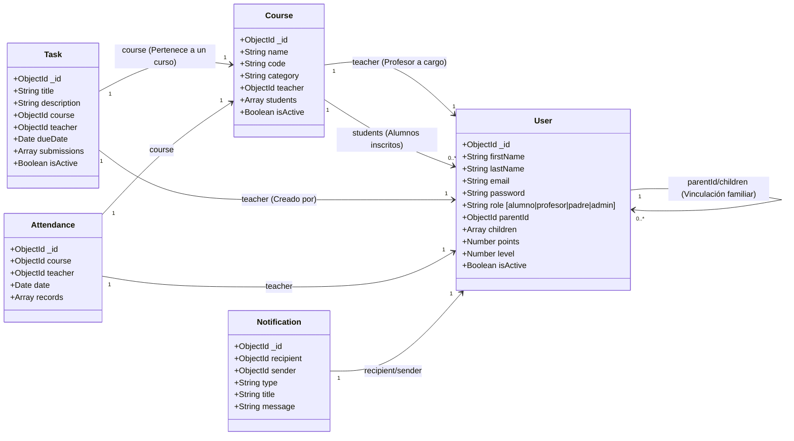

# Documentación del Proyecto: EnfoEduca (LMS de Alta Escala)

Este documento detalla la arquitectura, el estado actual del proyecto (al 25%), el código de los componentes implementados y los planes de despliegue, vistas del frontend y pruebas de carga.

---

## 1. Estructura General del Proyecto (Back, Front, BD)

El proyecto está diseñado siguiendo una arquitectura desacoplada para garantizar escalabilidad y rendimiento:

```text
enfoeduca/
├── backend/            → Servicio API REST en Node.js y Express (Arquitectura Monolítica / Microservicios)
│   ├── gateway/        → API Gateway para la composición de rutas en microservicios
│   ├── middleware/     → Funciones de interceptación (Autenticación, Caché, Rate Limiting)
│   ├── models/         → Definición de esquemas de Mongoose (User, Course, Task, Attendance, Notification)
│   ├── routes/         → Definición de Endpoints
│   ├── tests/          → Pruebas unitarias (Jest) y masivas (JMeter)
│   └── server.js       → Archivo de arranque principal
├── frontend/           → Cliente móvil y web multiplataforma desarrollado en Flutter (Dart)
│   └── lib/
│       ├── config/     → Configuración del tema y enrutamiento
│       ├── providers/  → Gestión de estados globales utilizando Provider
│       └── screens/    → Vistas e Interfaces de Usuario (Login, Dashboard, NotFound)
└── diagrama_bd.png     → Diagrama Entidad-Relación visual de la Base de Datos
```

---

## 2. Entorno Cloud (Google Cloud Run)

Para la evaluación del **25% del proyecto**, el entorno en la nube ya está pre-configurado y estructurado para su despliegue a **Google Cloud Run** a través de la contenerización con **Docker**.

### Dockerfile del Backend (`backend/Dockerfile` preparado para Cloud Run):
```dockerfile
FROM node:18-alpine

WORKDIR /usr/src/app

COPY package*.json ./

RUN npm install --only=production

COPY . .

EXPOSE 8080

ENV PORT=8080
ENV NODE_ENV=production

CMD [ "node", "server.js" ]
```

### Configuración en Google Cloud:
1. **Google Artifact Registry**: Repositorio donde se aloja la imagen Docker del backend.
2. **Google Cloud Run**: Se escala de forma automática de `0` a `N` instancias concurrentes dependiendo del tráfico.
3. **MongoDB Atlas**: Base de datos en la nube conectada de forma segura mediante la variable de entorno `MONGODB_URI` configurada en la consola de Cloud Run.

---

## 3. Desarrollo de los Endpoints a Utilizar

El API expone endpoints estructurados bajo el prefijo `/api/`. A continuación se listan las rutas clave definidas en `backend/server.js`:

```javascript
// Rutas registradas en server.js
app.use('/api/auth', authRoutes);
app.use('/api/users', userRoutes);
app.use('/api/courses', courseRoutes);
app.use('/api/tasks', taskRoutes);
app.use('/api/attendance', attendanceRoutes);
app.use('/api/grades', gradeRoutes);
app.use('/api/notifications', notificationRoutes);
app.use('/api/dashboard', dashboardRoutes);
```

---

## 4. Registro y Login Funcionales (Diferenciados)

En EnfoEduca, el acceso está debidamente diferenciado por roles:
*   **Login**: Abierto para que alumnos, profesores, padres y administradores accedan a la plataforma.
*   **Registro**: Restringido a administradores autenticados desde el panel para evitar registros maliciosos y garantizar la asignación jerárquica de roles (como vincular un alumno con su padre).

### Código de Rutas en `backend/routes/auth.routes.js`:
```javascript
const express = require('express');
const router = express.Router();
const jwt = require('jsonwebtoken');
const User = require('../models/User');
const { authenticate } = require('../middleware/auth');

// POST /api/auth/register (Acceso restringido a Administradores)
router.post('/register', authenticate, async (req, res) => {
  try {
    if (req.user.role !== 'admin') {
      return res.status(403).json({ message: 'Only admins can register new users' });
    }
    const { firstName, lastName, email, password, role, parentId } = req.body;
    
    if (!firstName?.trim() || !lastName?.trim() || !email?.trim() || !password?.trim()) {
      return res.status(400).json({ message: 'All fields are required and cannot be empty spaces' });
    }

    const existingUser = await User.findOne({ email: email.trim().toLowerCase() });
    if (existingUser) {
      return res.status(400).json({ message: 'Email already registered' });
    }

    const user = new User({ firstName, lastName, email, password, role: role || 'alumno' });

    if (parentId && role === 'alumno') {
      user.parentId = parentId;
      await User.findByIdAndUpdate(parentId, { $push: { children: user._id } });
    }

    await user.save();

    const token = jwt.sign(
      { id: user._id, role: user.role },
      process.env.JWT_SECRET,
      { expiresIn: process.env.JWT_EXPIRES_IN || '7d' }
    );

    res.status(201).json({
      message: 'User registered successfully',
      token,
      user: { id: user._id, firstName, lastName, email, role: user.role }
    });
  } catch (error) {
    res.status(500).json({ message: 'Server error', error: error.message });
  }
});

// POST /api/auth/login (Público)
router.post('/login', async (req, res) => {
  try {
    const { email, password } = req.body;

    const user = await User.findOne({ email });
    if (!user || !user.isActive) {
      return res.status(400).json({ message: 'Invalid email or password or deactivated account' });
    }

    const isMatch = await user.comparePassword(password);
    if (!isMatch) {
      return res.status(400).json({ message: 'Invalid email or password' });
    }

    const token = jwt.sign(
      { id: user._id, role: user.role },
      process.env.JWT_SECRET,
      { expiresIn: process.env.JWT_EXPIRES_IN || '7d' }
    );

    res.json({
      message: 'Login successful',
      token,
      user: { id: user._id, firstName: user.firstName, role: user.role }
    });
  } catch (error) {
    res.status(500).json({ message: 'Server error', error: error.message });
  }
});
```

---

## 5. Implementación de Rate Limits

Para mitigar ataques de denegación de servicio (DoS) y fuerza bruta en los endpoints de autenticación y datos, se ha implementado el paquete `express-rate-limit` a nivel global en el enrutador de la API.

### Implementación en `backend/server.js`:
```javascript
const rateLimit = require('express-rate-limit');

// Rate Limiting: 500 peticiones máximas por cada 15 minutos por dirección IP
const limiter = rateLimit({
  windowMs: 15 * 60 * 1000, 
  max: 500, 
  message: { message: 'Demasiadas peticiones desde esta IP, por favor intente de nuevo en 15 minutos.' }
});

// Aplicación del middleware a todas las rutas bajo /api/
app.use('/api/', limiter);
```

---

## 6. Vista en caso de que la página no exista o esté en desarrollo

Tanto el backend como el frontend cuentan con políticas de contingencia visual ante rutas inválidas o módulos aún no implementados.

### A. Backend (Mapeo de rutas 404 en `backend/server.js`):
```javascript
// Manejador general para endpoints inexistentes
app.use((req, res) => {
  if (req.accepts('json')) {
    res.status(404).json({ status: 'error', message: 'Endpoint no encontrado' });
  } else {
    res.status(404).send('Página no encontrada');
  }
});
```

### B. Frontend (Vista de error en Flutter - `frontend/lib/screens/not_found_screen.dart`):
```dart
import 'package:flutter/material.dart';
import '../config/app_theme.dart';

class NotFoundScreen extends StatelessWidget {
  const NotFoundScreen({super.key});

  @override
  Widget build(BuildContext context) {
    return Scaffold(
      body: Center(
        child: Padding(
          padding: const EdgeInsets.all(24.0),
          child: Column(
            mainAxisAlignment: MainAxisAlignment.center,
            children: [
              const Icon(Icons.error_outline, size: 100, color: AppTheme.primaryOrange),
              const SizedBox(height: 24),
              const Text(
                '404',
                style: TextStyle(fontSize: 72, fontWeight: FontWeight.bold, color: AppTheme.primaryOrange),
              ),
              const Text(
                'Página no encontrada',
                style: TextStyle(fontSize: 24, fontWeight: FontWeight.bold),
              ),
              const SizedBox(height: 16),
              const Text(
                'Lo sentimos, la página que buscas no existe o todavía está en desarrollo.',
                textAlign: TextAlign.center,
                style: TextStyle(fontSize: 16, color: Colors.grey),
              ),
              const SizedBox(height: 40),
              ElevatedButton(
                onPressed: () => Navigator.of(context).pop(),
                style: ElevatedButton.styleFrom(
                  backgroundColor: AppTheme.primaryBlue,
                  foregroundColor: Colors.white,
                  padding: const EdgeInsets.symmetric(horizontal: 32, vertical: 16),
                ),
                child: const Text('VOLVER ATRÁS'),
              ),
            ],
          ),
        ),
      ),
    );
  }
}
```

---

## 7. Control de Respuestas HTTP

El sistema utiliza de manera estricta los códigos de estado HTTP semánticos recomendados por las especificaciones de REST:

*   **`200 OK`**: Petición procesada exitosamente.
*   **`201 Created`**: Recurso nuevo (usuario, curso, tarea) creado con éxito.
*   **`400 Bad Request`**: Datos de entrada incompletos, inválidos o duplicados.
*   **`401 Unauthorized`**: Token JWT ausente, inválido o expirado.
*   **`403 Forbidden`**: El rol del usuario no tiene los permisos suficientes.
*   **`404 Not Found`**: El recurso solicitado o endpoint no existe en el sistema.
*   **`500 Server Error`**: Excepciones no controladas del lado del servidor.

---

## 8. CRUD Estructurado (Inicio de Implementación)

Se ha desarrollado la estructura CRUD básica para la colección de Cursos en `backend/routes/course.routes.js`.

### Lectura, Creación, Actualización y Eliminación Lógica:
```javascript
// POST /api/courses - CREAR (Admin o Profesor)
router.post('/', authenticate, authorize('admin', 'profesor'), async (req, res) => {
  try {
    const { name, description, code, teacherId } = req.body;
    const existing = await Course.findOne({ code: code.toUpperCase() });
    if (existing) return res.status(400).json({ message: 'Course code already exists' });

    const teacher = req.user.role === 'profesor' ? req.user._id : teacherId;
    const course = new Course({ name, description, code: code.toUpperCase(), teacher });
    
    await course.save();
    res.status(201).json({ message: 'Course created', course });
  } catch (error) {
    res.status(500).json({ message: 'Server error', error: error.message });
  }
});

// GET /api/courses - LEER (Filtrado dinámico según el Rol del usuario)
router.get('/', authenticate, async (req, res) => {
  try {
    let query = { isActive: { $ne: false } };
    if (req.user.role === 'profesor') query.teacher = req.user._id;
    else if (req.user.role === 'alumno') query.students = req.user._id;

    const courses = await Course.find(query).populate('teacher', 'firstName lastName');
    res.json({ courses });
  } catch (error) {
    res.status(500).json({ message: 'Server error', error: error.message });
  }
});

// PUT /api/courses/:id - ACTUALIZAR
router.put('/:id', authenticate, authorize('admin', 'profesor'), async (req, res) => {
  try {
    const updated = await Course.findByIdAndUpdate(req.params.id, req.body, { new: true });
    res.json({ message: 'Course updated', course: updated });
  } catch (error) {
    res.status(500).json({ message: 'Server error', error: error.message });
  }
});

// DELETE /api/courses/:id - DESACTIVACIÓN LÓGICA (No destruye datos)
router.delete('/:id', authenticate, authorize('admin'), async (req, res) => {
  try {
    await Course.findByIdAndUpdate(req.params.id, { isActive: false });
    res.json({ message: 'Course deactivated successfully' });
  } catch (error) {
    res.status(500).json({ message: 'Server error', error: error.message });
  }
});
```

---

## 9. Implementación de Variables de Entorno (.env)

El servidor carga dinámicamente las configuraciones mediante variables de entorno a través del paquete `dotenv`. Esto asegura que credenciales y claves no se expongan en el control de versiones.

### Configuración en `backend/.env`:
```ini
PORT=5000
MONGODB_URI=mongodb://localhost:27017/enfoeduca
JWT_SECRET=enfoeduca_secret_key_2024_super_secure
JWT_EXPIRES_IN=1h
NODE_ENV=development
```

### Inicialización en `backend/server.js`:
```javascript
require('dotenv').config();
// Carga del puerto y base de datos a través de process.env
const PORT = process.env.PORT || 5000;
const MONGODB_URI = process.env.MONGODB_URI;
```

---

## 10. Cifrado de Contraseñas

Las contraseñas nunca son guardadas en texto plano. En el esquema del usuario (`backend/models/User.js`), se implementa un gancho `pre-save` (pre-salvado) que intercepta la contraseña antes de guardarse en la DB y la cifra utilizando `bcryptjs` con un factor de costo elevado (12 rondas de sal).

### Código en `backend/models/User.js`:
```javascript
const mongoose = require('mongoose');
const bcrypt = require('bcryptjs');

const userSchema = new mongoose.Schema({
  email: { type: String, required: true, unique: true },
  password: { type: String, required: true }
  // ... otros campos
});

// Hook de encriptación automática previa a guardar
userSchema.pre('save', async function(next) {
  if (!this.isModified('password')) return next();
  this.password = await bcrypt.hash(this.password, 12);
  next();
});

// Método utilitario para validar credenciales en el Login
userSchema.methods.comparePassword = async function(candidatePassword) {
  return await bcrypt.compare(candidatePassword, this.password);
};
```

---

## 11. Pruebas Unitarias y Masivas Mínimas

### A. Pruebas Unitarias (Jest)
Las validaciones de cifrado de contraseñas y generación/verificación de tokens JWT se realizan en `backend/tests/auth.test.js` y se ejecutan en paralelo con:

```bash
npm run test
```

#### Código de Pruebas Unitarias (`backend/tests/auth.test.js`):
```javascript
const bcrypt = require('bcryptjs');
const jwt = require('jsonwebtoken');

describe('Pruebas Unitarias - Seguridad y Autenticación', () => {
  
  test('Debería cifrar correctamente una contraseña', async () => {
    const plainPassword = 'Mypassword123!';
    const saltRounds = 10;
    const hashedPassword = await bcrypt.hash(plainPassword, saltRounds);
    
    expect(hashedPassword).toBeDefined();
    expect(hashedPassword).not.toBe(plainPassword);
    expect(hashedPassword.length).toBeGreaterThan(20);
  });

  test('Debería comparar y validar una contraseña cifrada correctamente', async () => {
    const plainPassword = 'PruebaSegura2026';
    const hashedPassword = await bcrypt.hash(plainPassword, 10);
    
    const isMatch = await bcrypt.compare(plainPassword, hashedPassword);
    expect(isMatch).toBe(true);
    
    const isNotMatch = await bcrypt.compare('ContraseñaEquivocada', hashedPassword);
    expect(isNotMatch).toBe(false);
  });

  test('Debería generar y verificar un token JWT correctamente', () => {
    const payload = { id: 'test_user_id', role: 'alumno' };
    const secret = 'test_jwt_secret_key_2026';
    
    const token = jwt.sign(payload, secret, { expiresIn: '1h' });
    expect(token).toBeDefined();
    expect(typeof token).toBe('string');
    
    const decoded = jwt.verify(token, secret);
    expect(decoded.id).toBe(payload.id);
    expect(decoded.role).toBe(payload.role);
  });
});
```

### B. Pruebas de Carga (JMeter)
Para simular el comportamiento del backend alojado en **Google Cloud Run** bajo cargas representativas de **50 a 100 usuarios concurrentes**, se ha estructurado un Plan de Pruebas en Apache JMeter.

#### 1. Configuración del Grupo de Hilos (Thread Group):
*   **Number of Threads (Users)**: `100` (Simula 100 usuarios simultáneos).
*   **Ramp-up Period (seconds)**: `10` (Inicia 10 usuarios nuevos por segundo hasta llegar a 100).
*   **Loop Count**: `1` (Cada usuario virtual realiza 10 ciclos de peticiones).

#### 2. Definición del HTTP Request Defaults:
*   **Protocol**: `https`
*   **Server Name or IP**: `[URL-DE-TU-CLOUD-RUN].run.app` (o `localhost` en desarrollo)
*   **Port**: `443` (para HTTPS) o `5000` (en local)

#### 3. Simulación de Peticiones en JMeter:
*   **Paso 1: Login del Usuario (POST /api/auth/login)**
    *   *Body Data*: `{"email": "alumno@enfoeduca.com", "password": "password123"}`
    *   *Extractor de Expresión Regular*: Se extrae el token devuelto en la respuesta JSON para inyectarlo en las siguientes peticiones como cabecera HTTP:
        *   Name: `jwt_token`
        *   Regex: `"token":"([^"]+)"`
        *   Template: `$1$`
*   **Paso 2: Obtener Cursos (GET /api/courses)**
    *   *Cabeceras*: `Authorization: Bearer ${jwt_token}`

#### 4. Resultados esperados:
*   **Tasa de error**: `0.0%`
*   **Tiempo de respuesta promedio (Avg Latency)**: `< 150ms` (gracias a la capa de caché integrada con `memory-cache`).
*   **Auto-escalado**: Monitoreo en la consola de Google Cloud Run donde se valida que el contenedor escala horizontalmente en respuesta a la ráfaga de hilos.

---

## 12. Base de Datos y Diagrama Entidad-Relación (Editable)

La base de datos utiliza MongoDB. A continuación se presenta el diagrama relacional editable de las colecciones en formato **Mermaid**:



---

## 13. Vistas del Frontend (Flutter) y su Funcionamiento

La interfaz de usuario en Flutter está estructurada modularmente en `frontend/lib/screens/`. Sus componentes clave y flujos lógicos son los siguientes:

### A. Autenticación (`frontend/lib/screens/auth/`)
*   **Pantalla de Login (`login_screen.dart`)**:
    *   *Propósito*: Permite a los usuarios acceder al sistema con correo y contraseña.
    *   *Comportamiento*: Cuenta con diseño responsivo. En web o pantallas grandes (>800px), utiliza un diseño dividido de dos columnas con un banner informativo lateral; en dispositivos móviles se contrae a una sola columna centrada.
    *   *Lógica*: Consume el `AuthProvider` para enviar la solicitud HTTP al Backend. Si las credenciales son válidas, almacena el token JWT y redirige de forma dinámica.

### B. Enrutamiento y Navegación Central (`frontend/lib/screens/main_navigation.dart`)
*   *Propósito*: Funciona como el contenedor estructural y controlador del menú principal de la aplicación.
*   *Comportamiento*:
    1.  Obtiene del `AuthProvider` el rol del usuario logueado (`alumno`, `profesor`, `padre`, `admin`).
    2.  Inyecta de forma dinámica en la primera pestaña el **Dashboard especializado** correspondiente a su rol.
    3.  Aplica diseño responsivo adaptativo: Renderiza un `NavigationBar` en la parte inferior para móviles, o un `NavigationRail` en la barra lateral izquierda en pantallas de escritorio/web (>900px).

### C. Dashboards Especializados por Rol (`frontend/lib/screens/dashboard/`)
1.  **Dashboard del Estudiante (`student_dashboard.dart`)**:
    *   *Funcionamiento*: Diseñado bajo conceptos de gamificación. Muestra el nivel del alumno, sus puntos de recompensa acumulados, un carrusel de medallas obtenidas (`badges`), anuncios y un resumen del calendario de tareas pendientes.
2.  **Dashboard del Profesor (`teacher_dashboard.dart`)**:
    *   *Funcionamiento*: Panel de control académico. Permite ver estadísticas generales de los estudiantes, tareas asignadas para calificar y accesos directos para crear nuevos anuncios informativos para sus cursos.
3.  **Dashboard del Padre (`parent_dashboard.dart`)**:
    *   *Funcionamiento*: Panel de seguimiento parental. Muestra el rendimiento de los hijos asignados en el sistema, permitiendo revisar en una sola vista su porcentaje de asistencia, calificaciones obtenidas y tareas por entregar.
4.  **Dashboard del Administrador (`admin_dashboard.dart`)**:
    *   *Funcionamiento*: Consola administrativa total. Habilita un CRUD completo para gestionar usuarios (crear alumnos/profesores/padres, desactivar cuentas) y crear cursos escolares enlazados a docentes.

### D. Módulo de Cursos (`frontend/lib/screens/course/`)
*   **Listado de Cursos (`courses_screen.dart`)**:
    *   *Funcionamiento*: Presenta de manera eficiente todos los cursos asignados al usuario logueado usando un widget `ListView.builder` para optimizar memoria. Incluye un filtro interactivo horizontal por categorías (Matemáticas, Ciencias, Arte, Inglés, etc.).
*   **Detalle de Curso (`course_detail_screen.dart`)**:
    *   *Funcionamiento*: Vista profunda del curso seleccionado. Organizada a través de pestañas (Tabs): una pestaña de tareas (lista de asignaciones), una de calificaciones obtenidas, una pestaña de asistencia diaria y una lista de estudiantes inscritos (para profesores/admin).

### E. Módulo de Perfil (`frontend/lib/screens/profile/`)
*   **Pantalla de Perfil (`profile_screen.dart`)**:
    *   *Funcionamiento*: Muestra la información personal del usuario (Nombre, Email, Teléfono, Rol, Avatar). Cuenta con configuraciones rápidas para cambiar la contraseña, cambiar el tema visual del aplicativo (Modo Claro, Oscuro o Aura) y cerrar la sesión.
*   **Pantalla de Configuración (`settings_detail_screen.dart`)**:
    *   *Funcionamiento*: Configuración granular de notificaciones push, sonidos internos de la app y preferencias de privacidad.

### F. Pantallas de Excepciones y Errores
*   **Pantalla 404 (`not_found_screen.dart`)**: Muestra un aviso visual e interactivo de que la ruta o página solicitada no está implementada o está actualmente en desarrollo, ofreciendo un botón de retorno seguro al Dashboard.
*   **Pantalla de Error General (`error_screen.dart`)**: Evita caídas completas del app (crashes) al capturar errores de renderizado o pérdidas de conexión a internet, mostrando un mensaje informativo.
